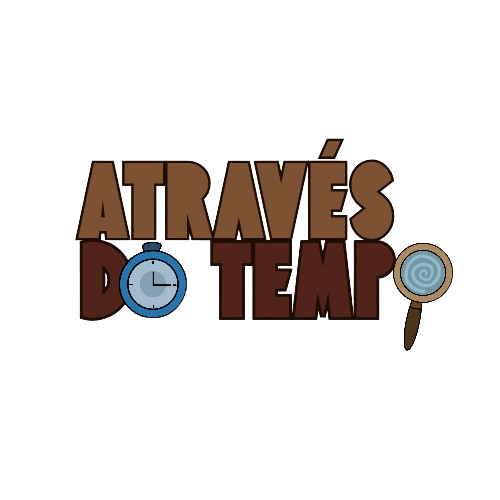
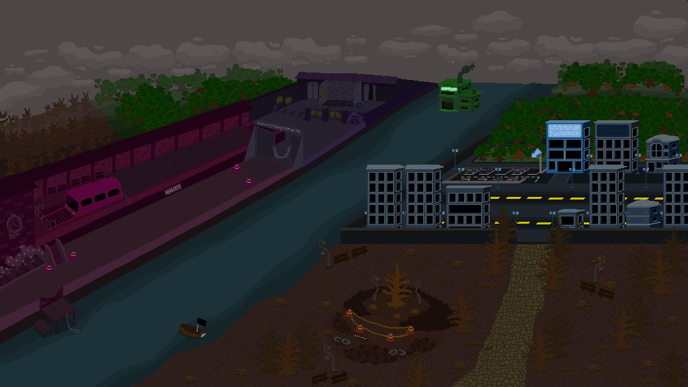
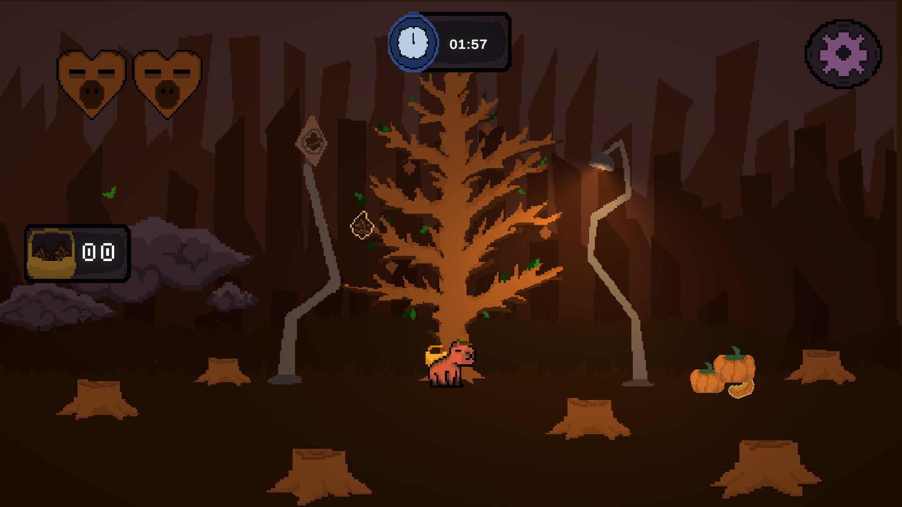
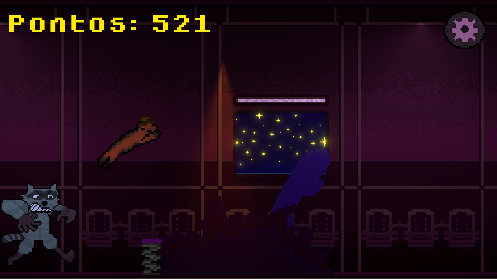
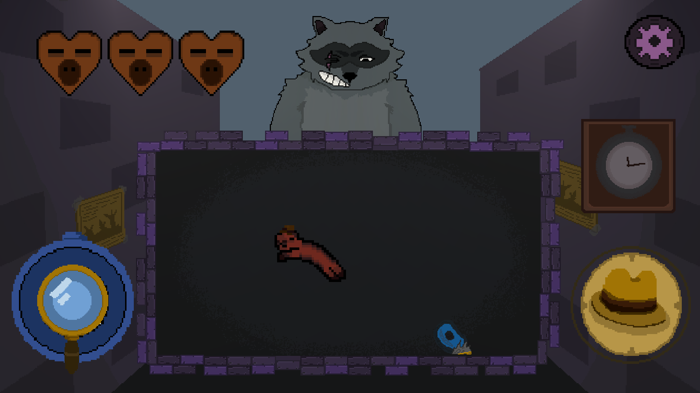
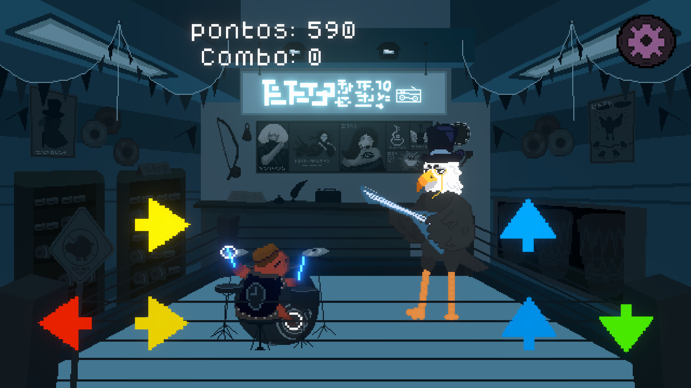
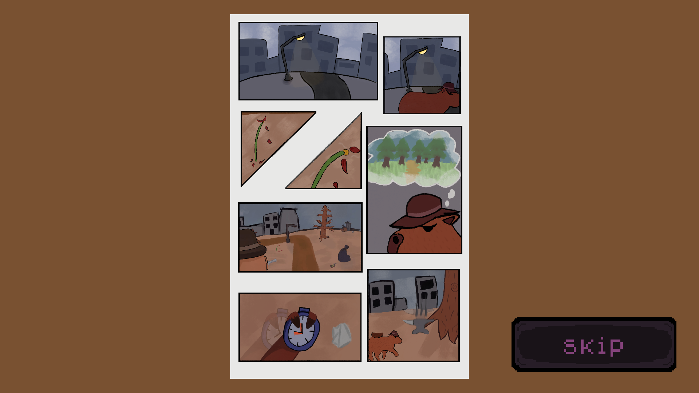
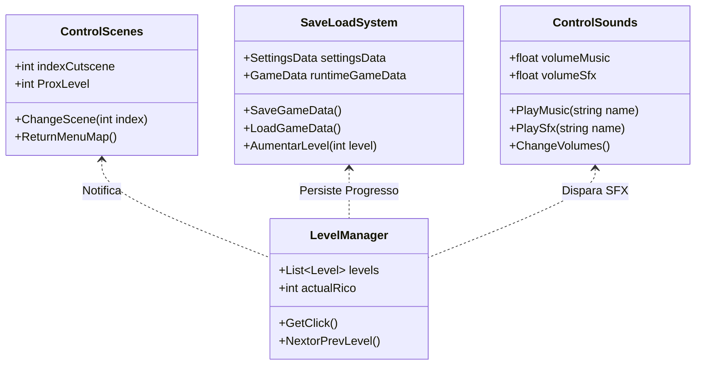

# Através do Tempo

<div align="center">

  

  <p align="center">
    <strong>Jogo de ação e aventura em pixel art desenvolvido pela equipe Aphronesia, combinando múltiplos gêneros de gameplay e narrativa contada em quadrinhos.</strong>
  </p>

  [](https://aphronesia.vercel.app/)
  [](https://unity.com/)
  [](https://learn.microsoft.com/dotnet/csharp/)
  [](https://unity.com/features/universal-render-pipeline)
  [](https://ferlemou.itch.io/atravesdotempo)
  [](#)
  [](https://ferlemou.itch.io/atravesdotempo)

</div>

---

## 📖 Sumário
- [Sobre o Jogo](#-sobre-o-jogo)
  - [Contexto Acadêmico](#-contexto-acadêmico)
  - [Premissa Narrativa](#-premissa-narrativa)
  - [Direção Artística & Atmosfera](#-direção-artística--atmosfera)
- [Mecânicas Principais & Fases](#-mecânicas-principais--fases)
  - [1. Coleta de Pinhas (Lane Catcher)](#1-coleta-de-pinhas-lane-catcher)
  - [2. Corrida no Trem (Endless Runner & Time Dilation)](#2-corrida-no-trem-endless-runner--time-dilation)
  - [3. Beco do Guaxinim (Boss Fight / Bullet Hell)](#3-beco-do-guaxinim-boss-fight--bullet-hell)
  - [4. Batalha Musical (Rhythm Battle)](#4-batalha-musical-rhythm-battle)
  - [Sistema de Cutscenes em HQ Interativa](#sistema-de-cutscenes-em-hq-interativa)
- [Arquitetura & Engenharia de Software](#-arquitetura--engenharia-de-software)
  - [Estrutura do Projeto](#estrutura-do-projeto)
  - [Padrões de Projeto (Design Patterns)](#padrões-de-projeto-design-patterns)
  - [Data-Driven Design & Charting com JSON](#data-driven-design--charting-com-json)
  - [Sistemas Centrais e Destaques Técnicos](#sistemas-centrais-e-destaques-técnicos)
- [Esquema de Controles](#-esquema-de-controles)
- [Como Executar o Projeto](#-como-executar-o-projeto)
  - [Pré-requisitos](#pré-requisitos)
  - [Instalação e Execução no Unity Editor](#instalação-e-execução-no-unity-editor)
- [Equipe & Créditos](#-equipe--créditos)
- [Publicação & Links](#-publicação--links)

---

## 🎮 Sobre o Jogo

### 🎓 Contexto Acadêmico
**Através do Tempo** foi concebido e desenvolvido pelo grupo **Aphronesia** como **Trabalho de Conclusão de Curso (TCC)** do curso técnico de **Jogos Digitais pela FIEB** (Fundação Instituto de Educação de Barueri). O projeto sintetizou o aprendizado de game design, engenharia de software em C#, modelagem e animação 2D, composição de áudio e gestão de projetos digitais.

### 📜 Premissa Narrativa
O jogo se passa em um futuro onde a degradação ambiental e a instabilidade climática destruíram os ecossistemas locais. O protagonista, Rico, é uma capivara detetive que decide voltar no tempo para tentar evitar esse desfecho.

Para a viagem, ele utiliza um trem adaptado por um amigo cientista como máquina do tempo, movido a combustível orgânico renovável. Ao longo do trajeto por diferentes eras, outros animais tentam impedir o avanço de Rico, revelando uma tentativa coordenada de sabotagem que culmina em um paradoxo temporal contra sua própria versão do futuro.

<div align="center">
  
  <p><em>Overworld interativo: navegação por nós com progressão persistente e transições em HQ.</em></p>
</div>

### 🎨 Direção Artística & Atmosfera
- **Estilo Visual:** Pixel art com animações quadro a quadro para personagens e elementos de cenário.
- **Narrativa Cinemática:** Transições de história estruturadas em páginas de quadrinhos (HQs) com câmera dinâmica desenvolvida na Unity.
- **Cenários:** Ambientes variados ao longo da progressão, cobrindo florestas, teto de trem em movimento, becos urbanos e interiores comerciais.

---

## 🕹️ Mecânicas Principais & Fases

O jogo adota uma estrutura **multigênero**, onde cada fase funciona com regras, objetivos e loops de gameplay próprios.

- **Progressão da Jornada:**
  - `Mapa do Mundo (Overworld)` → `Cutscene em HQ Interativa`
  - `Fase 1: Coleta de Pinhas` (Lane Catcher / Reflexos)
  - `Fase 2: Corrida no Trem` (Endless Runner / Manipulação Temporal)
  - `Fase 3: Beco do Guaxinim` (Boss Fight / Bullet Hell)
  - `Fase 4: Batalha Musical` (Rhythm Game / Duelo de Turnos)
  - `Conclusão & Desfecho`

---

### 1. Coleta de Pinhas (Lane Catcher)
*Cena: `MinigamePinhas.unity`*

<div align="center">
  
</div>

- **Objetivo:** Coletar pinhas para gerar combustível para a máquina do tempo antes que o cronômetro expire.
- **Mecânicas:**
  - **Movimentação em Pistas (Lanes):** Rico transita entre três posições horizontais fixas (Esquerda, Centro e Direita).
  - **Itens e Obstáculos:** Coleta de pinhas para somar pontos e corações para regenerar vida, desviando de bigornas que caem do topo da tela.
  - **Gestão de Vida e Tempo:** Temporizador regressivo (`Temporizador.cs`) e contador visual de corações (`HealthHeartManager.cs`).

---

### 2. Corrida no Trem (Endless Runner & Time Dilation)
*Cena: `MinigameTrem.unity`*

<div align="center">
  
</div>

- **Objetivo:** Percorrer o teto do trem em movimento, desviando de obstáculos e sobrevivendo ao trajeto.
- **Mecânicas:**
  - **Pulo e Super Pulo:** Pulo simples para desviar de obstáculos e super pulo acionado por caixas de som equipadas com molas.
  - **Cenário em Loop:** Reposicionamento vetorial do personagem (`Teleporte()`) ao atingir o limite do vagão, mantendo a sensação de corrida contínua.
  - **Power-Ups:**
    - **Relógio (`Clock.cs`):** Reduz o `Time.timeScale` da Unity temporariamente, criando um efeito de câmera lenta para facilitar as esquivas.
    - **Melancia (`Melon.cs`):** Ativa intangibilidade temporária (`TriggerInvisibility()`), desabilitando colisões com obstáculos via `Physics2D.IgnoreCollision`.
    - **Multiplicador de Pontos (`PowerUpTimeSpeed.cs`):** Reduz o intervalo de pontuação do `ScoreManager`, acelerando os pontos obtidos por tempo.

---

### 3. Beco do Guaxinim (Boss Fight / Bullet Hell)
*Cena: `BulletHell.unity`*

<div align="center">
  
</div>

- **Objetivo:** Enfrentar o Guaxinim em combate direto de plataforma e esquiva.
- **Lógica de Combate:**
  - **Fase de Esquiva:** O chefe dispara sequências de projéteis (halteres, anilhas e golpes de garra). Avisos visuais (`alertAttack.cs`) sinalizam a área de perigo antes dos ataques.
  - **Janela de Punição:** Ao término de cada série ofensiva, o chefe entra em estado de exaustão (`OnEnemyTired(true)`), liberando o botão de ataque (`PlayerAttack.cs`) para que o jogador cause dano.
  - **Controles de Plataforma:** Movimentação horizontal com física 2D, pulo com checagem de chão e suporte a teclado ou joystick virtual.

---

### 4. Batalha Musical (Rhythm Battle)
*Cena: `MinigameRitmo.unity`*

<div align="center">
  
</div>

- **Objetivo:** Vencer o duelo de ritmo contra o Carcará acertando as notas sincronizadas com a música.
- **Mecânicas:**
  - **4 Vias de Entrada:** Setas direcionais (Cima, Baixo, Esquerda e Direita) geradas com base na marcação rítmica da trilha sonora.
  - **Troca de Turnos:** O oponente executa a sequência melódica primeiro, e o jogador deve reproduzir as notas correspondentes em seu turno.
  - **Validação de Timing (`ArrowCollider.cs`):** Colisores que registram acertos e erros conforme a nota passa pela área de validação.

---

### 📖 Sistema de Cutscenes em HQ Interativa
*Cena: `Cutscenes.unity`*

<div align="center">
  
</div>

A narrativa entre as fases utiliza um sistema customizado de câmera para quadrinhos (`Cutscene.CameraPivot`):
- **Movimentação Não Linear:** Utiliza interpolação com curvas polinomiais ($t = 1 - (1 - t)^p$) para guiar a câmera suavemente entre os quadros.
- **Fade-in Sequencial:** Cada quadro da HQ surge com transição de opacidade no `SpriteRenderer`, conduzindo a leitura.
- **Enquadramento Final:** Ao término da cena, a câmera ajusta o `orthographicSize` para enquadrar a página completa.
- **Avanço Rápido:** O jogador pode pular para o próximo quadro ou avançar diretamente para o gameplay.

---

## 🛠️ Arquitetura & Engenharia de Software

O código foi estruturado com foco em boas práticas de programação em C#, desacoplamento e facilidade de manutenção no ecossistema da Unity.



### 📂 Estrutura do Projeto

```text
RicoAtravesdoTempo/
├── README.md
└── RicoGame/
    ├── Packages/
    │   └── manifest.json             # Dependências da engine (URP, 2D, UGUI, TMP, etc.)
    ├── ProjectSettings/
    │   ├── EditorBuildSettings.asset # Lista de cenas do build
    │   ├── InputManager.asset        # Mapeamento de eixos e teclas
    │   └── ProjectVersion.txt        # Versão: Unity 2022.3.62f3
    └── Assets/
        ├── JSON/
        │   └── MinigameRitmo/        # Arquivos de dados de notas musicais
        ├── Joystick Pack/            # Pacote para joysticks virtuais em tela touch
        ├── Scenes/                   # Cenas do jogo
        │   ├── Home.unity            # Menu principal
        │   ├── Cutscenes.unity       # Visualizador cinemático de HQs
        │   ├── MiniMapa.unity        # Mapa do mundo (Overworld)
        │   ├── MinigamePinhas.unity  # Fase 1: Coleta
        │   ├── MinigameTrem.unity    # Fase 2: Corrida
        │   ├── BulletHell.unity      # Fase 3: Batalha de Chefe
        │   └── MinigameRitmo.unity   # Fase 4: Batalha de Ritmo
        ├── Scripts/
        │   ├── Game/                 # Singletons centrais (Save, Cenas, Áudio, Câmera)
        │   ├── Home/                 # Gerenciador de menu inicial e configurações
        │   ├── Cutscene/             # Controle cinemático e interpolação de quadros
        │   ├── MenuMap/              # Lógica de seleção de níveis e movimentação no mapa
        │   ├── BulletHell/           # Lógica do Boss Guaxinim, ataques e jogador
        │   ├── MinigamePinha/        # Lógica de coleta de pinhas e danos
        │   ├── MinigameTrem/         # Runner, power-ups temporais e geração de obstáculos
        │   └── MinigameRitmo/        # Motor rítmico, leitor de JSON e colisores
        └── Sprites/                  # Recursos visuais organizados por módulo
```

### 🏛️ Padrões de Projeto (Design Patterns)

1. **Singleton Pattern Persistente (`DontDestroyOnLoad`):**
   - Implementado em sistemas centrais como `SaveLoadSystem`, `ControlScenes` e `ControlSounds`.
   - Garante que a transição de cenas não destrua instâncias vitais nem duplique objetos na hierarquia ao recarregar fases (`if (FindObjectsOfType<T>().Length > 1) Destroy(gameObject);`).
2. **Observer Pattern / Event-Driven Architecture:**
   - Uso de `public static event Action` para desacoplar a lógica de jogo, interface e áudio.
   - Exemplos: `EnemyControl.OnEnemyTired`, `EnemyAttack.OnAtkFinished`, `RitmoControl.OnChange`, `ScoreManager.OnGanhou`, `UIControl.OnLevel`.
3. **Interface Segregation & Polimorfismo:**
   - `IPowerUps`: Define a assinatura do método `Effect()` compartilhada por diferentes itens consumíveis (ex.: `Clock`, `Melon`, `PowerUpTimeSpeed`).
   - `IPlayer_Status`: Padroniza os atributos de vida e a recepção de dano/cura entre os diferentes minigames.
4. **State Machine Comportamental em Chefes:**
   - O boss do Bullet Hell opera em ciclo de estados explícitos: `Attacking` (combinações de projéteis) $\rightarrow$ `Tired` (janela vulnerável ao jogador) $\rightarrow$ `Damaged` $\rightarrow$ `Die`.

### 📊 Data-Driven Design & Charting com JSON
No minigame rítmico, os tempos de spawn, direção das setas e troca de turnos são abstraídos fora da lógica estática de código através da classe `RitmoJson.cs`:
- Leitura e gravação de arquivos serializados (`musica01.json`).
- Criação de comandos de inspeção no Unity Editor via atributos `[ContextMenu("Salvar JSON")]` e `[ContextMenu("Carregar JSON")]`, funcionando como uma ferramenta interna para os designers calibrarem novas faixas sem recompilar código.

### 📐 Sistemas Centrais e Destaques Técnicos
- **Ajuste de Proporção de Tela (`CameraSize.cs`):**
  - Compara o aspect ratio atual (`screenAspect`) com a base de 16:9 (`16f / 9f`).
  - Em resoluções ultrawide ou telas verticais, recalcula o `orthographicSize` e compensa a posição da câmera em Y para evitar cortes no conteúdo da cena.
- **Gerenciamento de Áudio (`ControlSounds.cs`):**
  - Canais dedicados para trilha sonora (`MusicSource`) e efeitos (`SfxSource`).
  - Mapeamento de clipes por chave identificadora e sincronização com as configurações de volume salvas.
- **Sistema de Salvamento (`SaveLoadSystem.cs`):**
  - Serialização de dados em formato JSON via `Application.persistentDataPath`.
  - Persiste o progresso de fases liberadas (`levelCompleted`), posição atual no mapa (`menuMapRico`) e recorde de pontos da fase do trem (`recordPoinsTrem`).

---

## 🎮 Esquema de Controles

O jogo foi projetado com suporte híbrido: totalmente funcional via **Teclado no PC** e otimizado para telas sensíveis ao toque (**Mobile / WebGL touch**) através de botões na UI e analógico virtual.

| Contexto / Fase | Ação | Teclado (PC) | Toque / Mobile |
| :--- | :--- | :--- | :--- |
| **Mapa do Mundo** | Selecionar Nível / Mover Rico | `Clique do Mouse` nas fases | `Toque Direto` no ponto da fase |
| **Cutscenes (HQs)** | Avançar / Pular Quadro | `Espaço` / Clique | Toque no botão de Skip na tela |
| **Fase 1: Coleta de Pinhas** | Deslocar para Esquerda | `Seta Esquerda` ou `J` | Toque no lado esquerdo da tela |
| | Posição Central | `K` | Retorno automático por posição |
| | Deslocar para Direita | `Seta Direita` ou `L` | Toque no lado direito da tela |
| **Fase 2: Corrida no Trem** | Pular / Salto Normal | `Barra de Espaço` | Botão virtual de Pulo |
| | Super Pulo | Contato automático com a Mola + Pulo | Contato com a Mola + Toque de Pulo |
| **Fase 3: Beco do Guaxinim** | Movimentação Horizontal | `A` / `D` ou `Setas Esquerda/Direita` | Analógico Virtual (`Fixed Joystick`) |
| | Pular | `Barra de Espaço` | Botão virtual de Pulo |
| | Golpear o Chefe | Botão de Ataque na UI | Toque no botão de Ataque na HUD |
| **Fase 4: Batalha Musical** | Nota Superior (Cima) | `W`, `Seta Cima` ou `K` | Toque na seta Cima |
| | Nota Inferior (Baixo) | `S`, `Seta Baixo` ou `L` | Toque na seta Baixo |
| | Nota Esquerda | `A`, `Seta Esquerda` ou `H` | Toque na seta Esquerda |
| | Nota Direita | `D`, `Seta Direita` ou `J` | Toque na seta Direita |
| **Menus & Pausa** | Pausar / Despausar | `Esc` ou Botão de Menu | Botão de Engrenagem / Menu |

---

## 🚀 Como Executar o Projeto

### Pré-requisitos
- **Unity Hub** instalado.
- **Unity Editor 2022.3.62f3 LTS** (com suporte a módulos Windows/Linux/WebGL/Android).
- **Git** instalado na máquina.

> [!NOTE]
> **Observação sobre a versão da Engine:** O projeto foi originalmente desenvolvido na versão `2022.3.52f1 LTS`, mas foi migrado para a `2022.3.62f3` seguindo as recomendações oficiais de estabilidade e patches da Unity.

### Instalação e Execução no Unity Editor

1. **Clone o repositório:**
   ```bash
   git clone https://github.com/ferlemou/RicoAtravesdoTempo.git
   ```

2. **Abra o projeto no Unity Hub:**
   - Abra o **Unity Hub**.
   - Clique em **Add** (Adicionar projeto a partir do disco).
   - Selecione a pasta do projeto interno: `RicoAtravesdoTempo/RicoGame`.
   - Certifique-se de vincular o editor com a versão **Unity 2022.3.62f3**.

3. **Cena Inicial recomendada:**
   - No painel de pastas da Unity (`Project`), navegue até:
     ```text
     Assets > Scenes > Home.unity
     ```
   - Dê um duplo clique na cena `Home.unity`.
   - Pressione o botão **Play (▶)** no topo do Unity Editor para iniciar o fluxo completo com áudio, menus e saves sincronizados.

---

## 👥 Equipe & Créditos

O projeto foi concebido e construído colaborativamente pela equipe **Aphronesia**:

<div align="center">
  
</div>

| Integrante | Papel Principal | Contribuições Chave |
| :--- | :--- | :--- |
| **Caneca** | Sound Designer Principal | Composição de trilhas sonoras originais, sonoplastia dos minigames, efeitos sonoros (SFX) e apoio em level design. |
| **Dominique Toledo** | Gerente de Projeto, Programador & Artista | Gestão de cronograma e escopo, ilustração artística das páginas de HQ (cutscenes), curadoria de assets e refatoração de código da primeira fase. |
| **Felipe Moura** | Programador Principal | Arquitetura de software em C#, lógica e programação das mecânicas de todos os minigames, sistemas de física e implementação de saves. |
| **Jonas Gomes** | Artista & Designer Principal | Arte conceitual, design visual e ilustração de cenários principais do jogo. |
| **Murilo Cesar** | Designer de Mundo & Assets Visuais | Criação de sprites de personagens, direção estética, ambientalização e arte dos minigames. |
| **Nayara Domingues** | Documentação & Web Developer | Redação e estruturação da documentação do TCC, conceitualização narrativa e desenvolvimento do site oficial. |

---

## 🌐 Publicação & Links

- 🌐 **Website Oficial:** [aphronesia.vercel.app](https://aphronesia.vercel.app/)
- 📄 **Página do Projeto (Detalhes & Sinopse):** [aphronesia.vercel.app/projetos](https://aphronesia.vercel.app/projetos)
- 🕹️ **Versão Jogável no Itch.io:** [https://ferlemou.itch.io/atravesdotempo](https://ferlemou.itch.io/atravesdotempo)
- 🏢 **Instituição:** FIEB (Fundação Instituto de Educação de Barueri)
- 📚 **Curso:** Técnico em Jogos Digitais

---

<div align="center">
  <sub>Desenvolvido com carinho e café pela equipe Aphronesia. Todos os direitos reservados.</sub>
</div>
